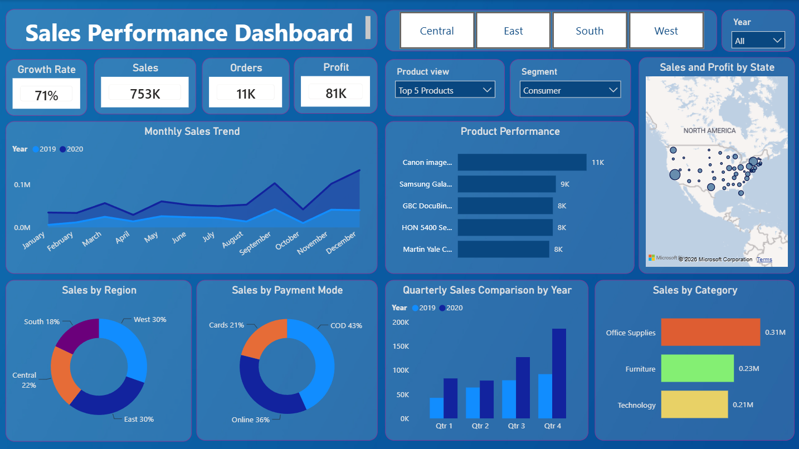

# 📊 Sales Performance Dashboard

### Data Analyst Internship Assignment – Syntecxhub

An interactive **Sales Performance Dashboard** built using **Power BI** to analyze sales performance across different regions, categories, products, and time periods. This project demonstrates data cleaning, KPI creation, DAX measures, and interactive data visualization.

---

## 📌 Project Overview

The objective of this project is to transform raw sales data into meaningful business insights through an interactive Power BI dashboard.

The dashboard enables users to:
- Analyze monthly and quarterly sales trends.
- Compare sales across regions and categories.
- Identify top-performing and low-performing products.
- Monitor key business KPIs.
- Interact with the dashboard using filters and slicers.

---

## 🛠️ Tools & Technologies

| Tool | Purpose |
|------|---------|
| Power BI Desktop | Dashboard Development |
| Power Query | Data Cleaning & Transformation |
| DAX | KPI Measures & Calculations |

---

## 📂 Dataset

**Dataset:** SuperStore Sales Dataset

**File Format:** CSV

**Years Covered:** 2019–2020

**Key Columns:**
- Order Date
- Ship Date
- Product Name
- Category
- Region
- Segment
- Sales
- Profit
- Quantity
- Payment Mode

---

## 📊 Dashboard Features

- ✅ Total Sales KPI
- ✅ Total Profit KPI
- ✅ Total Orders KPI
- ✅ Growth Rate KPI
- ✅ Monthly Sales Trend
- ✅ Quarterly Sales Comparison by Year
- ✅ Sales by Region
- ✅ Sales by Category
- ✅ Sales by Payment Mode
- ✅ Product Performance (Top 5 / Bottom 5)
- ✅ Interactive Region Filter
- ✅ Interactive Segment Filter
- ✅ Interactive Year Filter

---

## 📈 KPIs Created

- Total Sales
- Total Profit
- Total Orders
- Growth Rate

---

## 📸 Dashboard Preview



---

## 💡 Key Insights

- Sales show an increasing trend throughout the year.
- The West region contributes the highest sales.
- Office Supplies is the leading product category by sales.
- COD is the most preferred payment mode.
- Users can dynamically switch between the Top 5 and Bottom 5 products using the Product Performance filter.

---

## 📁 Repository Structure

```
Syntecxhub_Sales_Performance_Dashboard/
│
├── Sales_Performance_Dashboard.pbix
├── SuperStore_Sales_Dataset.csv
├── Dashboard_Screenshot.png
└── README.md
```

---

## 👨‍💻 Author

**Diksha Bedkute**

B.E – Artificial Intelligence and Data Science Engineering

DMCE College, Mumbai University

**GitHub:** https://github.com/Diksha1719

**LinkedIn:** https://www.linkedin.com/in/diksha-b-584643378

---

## ⭐ Internship Task 1 Completed

✔ Imported and cleaned the sales dataset using Power Query.

✔ Analyzed monthly and quarterly sales trends.

✔ Identified top-performing and low-performing products.

✔ Compared sales across regions and categories.

✔ Created KPIs including Total Sales, Total Profit, Total Orders, and Growth Rate.

✔ Built an interactive dashboard using Power BI with slicers and dynamic product analysis.

---

This project was developed as part of the **Syntecxhub Data Analyst Internship**.
